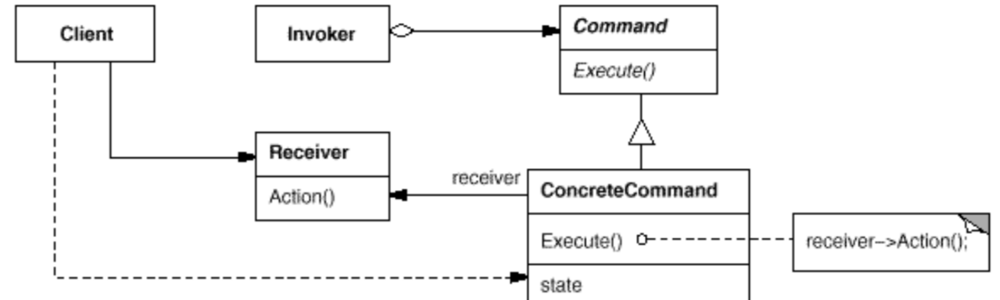

 # Command pattern
 
  - 일련의 기능을 하나의 객체를 캡슐화한다.
  - execute메소드를 통해 기능을 수행시킨다.
  - 매개변수를 통해 여러 요구사항을 추가할 수도 있고 로그나 작업취소기능도 지원한다.

 


 --- 
  1. Command: 객체의 인터페이스, execute메소드를 가짐
  2. ConcreteCommand: command 구현하는 부분
  3. receiver: command에 의해서 변화하는 부분, 기능을 수행하면서 변화하는 부분
  4. invoker: 커멘드를 저장하는 부분

---
 ## example
  - 불을 켜고 끄려고한다.
  - 이를 command pattern으로 구현해보자

  1. Command(Command): 커멘드 객체의 인터페이스
  2. ConcreteCommand(LightOffCommand, LightOnCommand): 기능을 구현하는 부분
  3. receiver(Light): command에 의해 불이 실제로 꺼지고 켜지는 부분
  4. invoker(RemoteControl): 커멘드를 저장하고 관리하는 부분

---

 1. Command
```
public interface Command {
    public void execute();
}
```

 2. LightOffCommand
```
public class LightOffCommand implements Command {
    Light light;
	
    public void execute() {
        light.off();
    }
	
    public LightOffCommand(Light light) {
        this.light = light;
    }
	
}
```

 3. LightOnCommand
```
public class LightOnCommand implements Command {
    Light light;
	
    public void execute() {
        light.on();
	}
	
    public LightOnCommand(Light light) {
        this.light = light;
    }
}
```

 4. Light
```
public class Light{
    String state = "Quantum";
    String name = "";
     
    public Light(String name) {
         this.name = name;
    }
    
    public void off() {
        state = "OFF";
    }
	
    public void on() {
        state = "ON";
    }
}
 
```

 5. RemoteControl


```
public class RemoteControl {
	Command[] onCommands;
	Command[] offCommands;
	
	public RemoteControl() {
		onCommands = new Command[7];
		offCommands = new Command[7];
		
		Command noCommand = new NoCommand();
		for(int i =0; i < 7; i++) {
			onCommands[i] = noCommand;
			offCommands[i] = noCommand;
		}
	}
	
	public void setCommand(int slot, Command onCommand, Command offCommand) {
		onCommands[slot] = onCommand;
		offCommands[slot] = offCommand;
	}
	
	public void onButtonWasPushed(int slot) {
		onCommands[slot].execute();
	}
	
	public void offButtonWasPushed(int slot) {
		offCommands[slot].execute();
	}
	
	public String toString() {
		 String ret = "---------- Remote Control --------\n";
		 for(int i =0; i < onCommands.length; i++) {
			 ret += "[slot" + i + "]" + onCommands[i].getClass().getName() + "    " + offCommands[i].getClass().getName() + "\n";
		 }
		 ret += "---------------------------------------\n";
		 return ret;
	}
}
```

 6. main
```
public static void main(String[] args) {
    RemoteControl remoteControl = new RemoteControl();
    Light livingRoomLight = new Light("Living Room");
    Light kitchenLight = new Light("Kitchen");
    LightOnCommand livingRoomLightOn = new LightOnCommand(livingRoomLight);
    LightOffCommand livingRoomLightOff = new LightOffCommand(livingRoomLight);
    LightOnCommand kitchenLightOn = new LightOnCommand(kitchenLight);
    LightOffCommand kitchenLightOff = new LightOffCommand(kitchenLight);
    remoteControl.setCommand(0, livingRoomLightOn, livingRoomLightOff);
    remoteControl.setCommand(1, kitchenLightOn, kitchenLightOff);
    System.out.println(remoteControl);
    remoteControl.onButtonWasPushed(0);
    remoteControl.offButtonWasPushed(0);
    remoteControl.onButtonWasPushed(1);
    remoteControl.offButtonWasPushed(1);
}		
```

