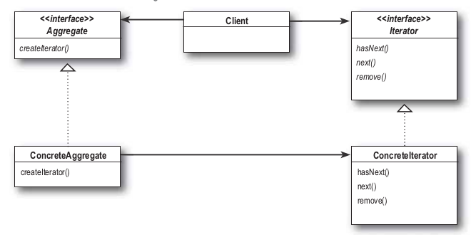

 # Iterator Pattern
 ---
 
  - 반복을 캡슐화하는 패턴
  - 반복되는 collection을 **드러내지 않고** 안에 있는 모든 항목에 접근가능

 
 
 
 
 --- 
 
 1. aggregate: 반복할 집합체 인터페이스
 2. concreteAggregate: 반복할 집합체, iterator를 통해 반복할 것
 3. iterator: 반복자 인터페이스
 4. concreteIterator: 반복자, hasNext(), next(), remove() 등의 메소드 지원

---

 ## 예시
 - 웨이터가 메뉴를 알려주는 경우를 생각하자
 - 크게 메뉴는 PancakeHouseMenu, DinerMenu 두 종류로 나뉜다.
 - 이를 iterator를 통해 구현해보자
