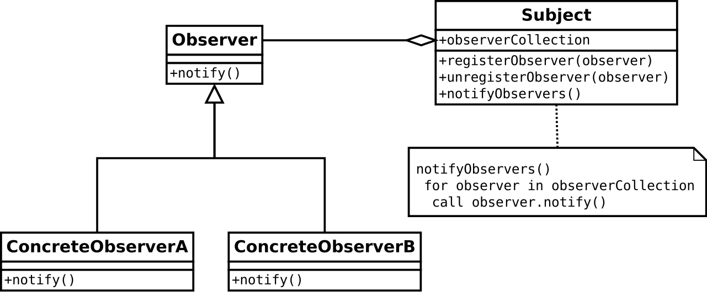

 # Observer Pattern
 
 - **Observer pattern == Subscriber + Publisher**
 - publisher(**subject**)가 콘텐츠를 생산하고 그것을 구독하는 subscriber(**observers**)로 구성되어있다
 - subject는 하나이고 observers는 많을 때(**one-to-many relationship**) 사용하기 좋은 패턴이다 
 - observer들은 독립적이고 subject에서 update를 해주면 변화들을 각 observer에 전달해준다


 
 
 ---
 
 ## example
 
  - 랜덤 숫자를 생성해 ```10진수```로 표현하거나 ```*```의 개수로 표현하는 프로그램을 생각해보자
  - 랜덤으로 숫자를 생성하는 클래스에서 ```10진수로 표현하는 클래스```와 ```*의 개수로 표현하는 클래스```에 update를 해줘야한다.
  
  ### class 종류
   1. NumberGenerator(**abtract subject class**): 숫자를 생성해 변화를 전달함
   2. RandomNumberGenerator:(**concrete subject class**): 랜덤숫자를 생성함
   3. Observer(**observer interface**)
   4. DigitObserver(**concrete observer class**): 숫자를 ```십진수```로 표현
   5. GraphObserver(**concrete observer class**): 숫자를 ```*의 개수```로 표현

----

 1. NumberGenerator
 ```
 //import 
 import java.util.ArrayList;
 
 public abstract class NumberGenerator {
	// observer list
	private ArrayList observers = new ArrayList();
	
	public abstract int getNumber();
	public abstract void execute();
	
	public void addObserver(Observer observer) {
		observers.add(observer);
	}
	
	public void deleteObserver(Observer observer) {
		observers.remove(observer);
	}
	
	// notify observers content update
	public void notifyObservers() {
		Iterator iter = observers.iterator();
		while(iter.hasNext()) {
			Observer o = (Observer)iter.next();
			o.update(this);
		}
	}
}
```

 2. RandomNumberGenerator
```
//import
import java.util.Random;

public class RandomNumberGenerator extends NumberGenerator {
	private Random random = new Random();
	private int number;
	
	public int getNumber() { return this.number; }
	public void execute() {
		for(int i=0; i<20; i++) {
			this.number = random.nextInt(50);
			notifyObservers();
		}
	}
}
```

 3. Observer
```
public interface Observer {
	public abstract void update(NumberGenerator generator);
}
```

 4. DigitObserver
```
public class DigitObserver implements Observer {
	
	public DigitObserver(NumberGenerator num) {
		num.addObserver(this);
	}
	
	@Override
	public void update(NumberGenerator generator) {
		// TODO Auto-generated method stub
		System.out.println("DigitObserver: " + generator.getNumber());
		try {
			Thread.sleep(100);
		} catch (InterruptedException e) {
			e.printStackTrace();
		}
	}
}
```
 5. GraphObserver
```

public class GraphObserver implements Observer {
	
	public GraphObserver(NumberGenerator num) {
		num.addObserver(this);
		
	}

	@Override
	public void update(NumberGenerator generator) {
		// TODO Auto-generated method stub
		System.out.print("GraphObserver: ");
		
		for(int i=0; i<generator.getNumber(); i++) { System.out.print("*"); }
		System.out.println("");
		
		try {
			Thread.sleep(100);
		} catch (InterruptedException e) {
			e.printStackTrace();
		}
	}
}
```

 6. main
```
public class ObserverPatternExample {

	public static void main(String[] args) {
		NumberGenerator a = new RandomNumberGenerator();
		DigitObserver b = new DigitObserver(a);
		GraphObserver c = new GraphObserver(a);
		
		a.execute();
	}

}
```
