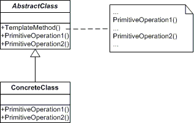

 # Template method pattern
  - 알고리즘을 메소드에 정의하고 각각의 메소드의 순서만 미리 정해놓는다
  - 각각의 subClass에서 메소드를 재정의하는 pattern
  - 알고리즘의 구조가 변경되지 않는다 
 
  
  
  ---
  
   1. AbstractClass: 알고리즘의 skeleton과 순서를 적어놓은 클래스
   2. ConcreteClass: 알고리즘을 정의하는 자식클래스

---
 ## 예제
  - 커피와 차를 만드는 알고리즘을 설계하자
  - 커피는 물을 끓이고 커피를 우리고 컵에 담고 설탕을 추가한다.
  - 차는 물을 끓이고 티배을 담그고 컵에 담고 레몬을 추가한다.


 1. AbstractClass(CaffeineBeverage): prepareRecipe 메소드에 알고리즘의 순서를 정의하자 
 <p> 물을 끊이는 것과 컵에 담는 것은 공통과정이니 미리 구현하자

 2. ConcreteClass(Coffee, Tea): 알고리즘을 구현하자
 
 
 ---
 
  1. CaffeineBeverage
 ```
 public abstract class CaffeineBeverage {
	public final void prepareRecipe() {
		boilWater();
		brew();
		pourInCup();
		addCondiments();
	}
	
	public abstract void brew();
	public abstract void addCondiments();
	public void boilWater() {
		System.out.println("Boiling water");
	}
	public void pourInCup() {
		System.out.println("Pouring into cup");
	}
}
 ```
  2. Coffee
 ```
 public class Coffee extends CaffeineBeverage{
	public void brew() {
		System.out.println("Dripping Coffee through filter");
	}
	
	public void addCondiments() {
		System.out.println("Adding Suger");
	}
}
 ```
 
  3. Tea
 ```
 public class Tea extends CaffeineBeverage {
	public void brew() {
		System.out.println("Steeping the tea");
	}
	
	public void addCondiments() {
		System.out.println("Adding lemon");
	}
}

 ```
 
  4. main
 ```
public static void main(String[] args) {
		Tea tea = new Tea();
		tea.prepareRecipe();
		System.out.println();
		Coffee coffee = new Coffee();
		coffee.prepareRecipe();
	}
 ```
