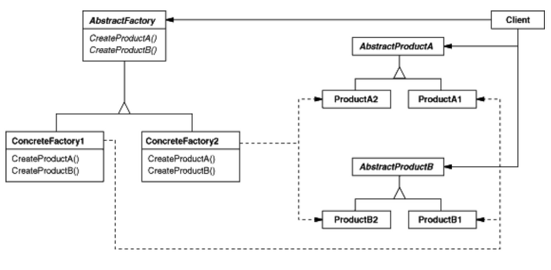

# Abstract factory

## abstract factory
연관된 여러 객체를 생성하기 위한 factory 인터페이스를 만들고 이 인터페이스를 사용자에게 제공

### 1. 사용처
 - 관련성이 있는 객체를 묶어서 함께 사용되어야할 때
 - product 클래스에 대한 인터페이스만 제공하고 싶을때

### 2. 구조
 - client: abstractFactory, abstractProduct를 interface함
 - concreteProduct: 구체적인 객체
 - abstractProduct: concreteProduct의 일반적인 형태
 - concreteFactory: concreteProduct를 생성하는 곳
 - abstractFactory: concreteFactory의 일반적인 형태

### 3. 특징
 - concrete class의 고립, client는 인터페이스를 통해 concrete class에 접근한다.
 - product를 바꾸기 쉽다. 그냥 바꾸면 더 수정할 필요가 없다.
 - pruduct간 일관성이 있도록 한다
 - 새로운 product를 만드는 것이 어렵다

### 4. 예시
 ** 두 종류의 필기구 세트(stationaryA, stationaryB)가 있다고 생각하자 **
 
 ** 각 필기구 세트에는 연필(pencil), 볼펜(ballPoint), 지우개(eraser), 수정테이프(correctionTape)가 있다고 하자 **
 
 ** 이 때 필기구는 각 세트별로 판매해야한다. stationaryA의 연필, 볼펜과 stationaryB의 지우개 수정테이프를 판매하는 식의 섞어팔기는 허용되지 않는다 **
 
 

 
 - abstractFactory: stationary의 인터페이스
 - concreteFactory: stationaryA, stationaryB
 - abstractProduct: pencil, ballPoint, eraser, correctionTape
 - concreteProduct: stationaryA의 pencil, stationaryB의 eraser 등등
