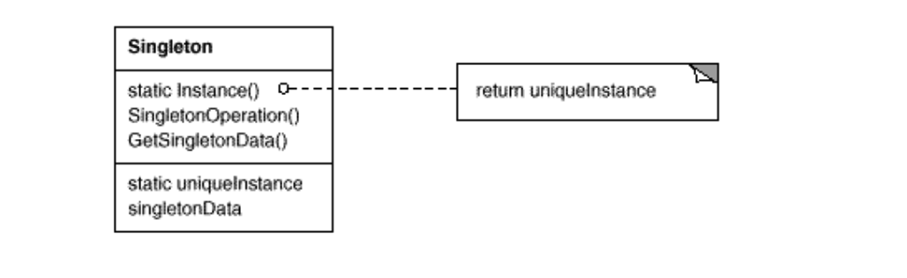

# Singleton pattern

 
 

- 객체를 하나만 생성하고 그 객체에 접근가능하도록 만든 패턴
- 생성자를 private로 하고 getInstance 메소드를 통해 생성함

---

```
public class Logger {
    private Logger() {}
    
    private static Logger uniqueInstance;
    public static Logger getInstance() {
    if (uniqueInstance == null)
        uniqueInstance = new Logger();
    return uniqueInstance;
    }
}
```

--- 
 - 위 코드의 문제점: 여러 쓰레드가 동시에 getInstance()에 접근하면 객체가 여러 개 만들어질 수 있다
 - 해결책은 double checked locking, eager initialization이 있다


1. **double checked locking**

    synchroized 키워드를 통해 쓰레드의 동시접근을 막음
    
    다만, 성능이 저하됨
```
public class Singleton {
    private Singleton() {}
    private volatile static Singleton uniqueInstance;
    public static Singleton getInstance() {
        if (uniqueInstance == null) { //single checked
            synchronized(Singleton.class) {
                if(uniqueInstance == null) //double checked
                    uniqueInstance = new Singleton();
                }
        }
        return uniqueInstance;
    }
}
```

2. **eager initialization**

     미리 객체를 초기화하고 getInstance는 미리 생성된 객체를 return만 
```
public class Singleton {
    private Singleton() {}
    private static Singleton uniqueInstance = new Singleton()
    public static Singleton getInstance() {
        return uniqueInstance;
    }
}
```
