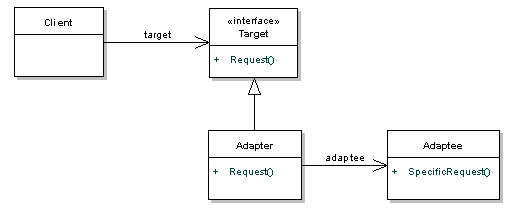

 # Adapter pattern
 
  - 어댑터는 서로 다른 기기를 연결할 수 있도록 만드는 장치있다
  - 객체지향에서의 adapter도 이와 비슷하게 client에서 요구하는 인터페이스와 쓰려고하는 클래스를 이어주기 위해 adapter라는 클래스를 활용한다. 
  - JAVA에서 iterator와 enumeration을 연결하기 위해 adapter를 사용하기도 한다

 
 

 1. Client: Target 인터페이스만 관찰한다.
 2. Target: 목표 인터페이스
 3. Adaptee: 변환해서 접근하고 싶은 인터페이스
 4. ConcreteAdaptee(그림에는 없음): Adaptee를 implements한 클래스
 5. Adapter: Target과 Adaptee를 연결하는 클래스


-----
 
 ## 예시
  - 오리(Duck) 인터페이스를 통해 칠면조(Turkey) 인터페이스에 접근하려고한다.
  - 이를 Adapter pattern을 이용해 구해보자

 1. Client: Main
 2. Target: Duck
 3. Adaptee: Turkey
 4. ConcreteAdaptee: WildTurkey
 5. ConcreteTarget: MallardDuck
 6. Adapter: TurkeyAdapter

---

 1. Duck
```
public interface Duck {
	public void quack();
	public void fly();
}
```

 2. MallardDuck
```
public class MallardDuck implements Duck{
	public void quack() {
		System.out.println("Quack");
	}
	
	public void fly() {
		System.out.println("I'm flying");
	}
}

```

 3. Turkey
```
public interface Turkey 
	public void gobble();
	public void fly();
}

```

 4. WildTurkey
```
public class WildTurkey implements Turkey {
	public void gobble() {
		System.out.println("Gobble gobble");
	}
	
	public void fly() {
		System.out.println("I'm flying a short distance");
	}
}

```

 5. TurkeyAdapter
```
public class TurkeyAdapter implements Duck {
	Turkey turkey;
	
	public TurkeyAdapter(Turkey turkey) {
		this.turkey = turkey;
	}
	
	public void quack() {
		turkey.gobble();
	}
	
	public void fly() {
		for(int i =0; i < 5; i++) {
			turkey.fly();
		}
	}
}
```
 
 6. Main
```
public static void main(String[] args) {
		MallardDuck duck = new MallardDuck();
		
		WildTurkey turkey = new WildTurkey();
		Duck turkeyAdapter = new TurkeyAdapter(turkey);
		
		System.out.println("The Turkey says...");
		turkey.gobble();
		turkey.fly();
		
		System.out.println("\nThe Duck says...");
		testDuck(duck);
		
		System.out.println("\nThe TurkeyAdapter says...");
		testDuck(turkeyAdapter);

	}
	
	static void testDuck(Duck duck) {
		duck.quack();
		duck.fly();
	}
}
```
