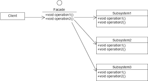

 # Facade pattern
  - client가 **직접** 수 많은 subClass에 접근하는 대신, facade객체를 통해 접근해서 subClass에 대해 알 필요가 없도록 한다.
  - facade객체는 일종의 scheduler역할을 한다.
  - facade패턴은 principle of leat knowledge를 만족시키는데 도움이 된다.
 
 ## Principle of least knowledge(Law of Demeter)
  - 가장 친한 친구와만 소통해라
  - 객체와의 상호작용을 최소화해서 코드의 질을 높일 수 있다.
  - 높이는 방법: 아래에 해당하는 메소드만 호출할 것
      1. 객체 자신의 메소드
      2. 메소드의 매개변수로 넘어온 인자의 메소드
      3. 메소드 내부에서 생성 된 객체의 메소드(메소드 밖에서 선언 & 안에서 할당)
      4. 메소드가 포함하고 있는 객체의 메소드(메소드 안에서 선언 & 할당됨)


 
 
 
  1. Facade: Client대신에 SubClass에 접근하는 클래스
  2. SubSystems: 각각의 기능을 수행하는 서브클래스

 ## 예시
  - 집에서 영화를 본다
  - 영화를 보기 위해서 팝콘을 튀기고 스크린을 내리고 프로젝트를 켜서 dvd를 실행해야한다.
  - 영화를 끝내긴 위해서 팝콘을 그만 튀기고 스크린을 올리고 프로젝트를 끄고 dvd를 종료해야한다.
  - 이 과정을 facade pattern을 이용해서 구현해보자

 1. Facade(HomeTheaterFacade): facade객체
 2. Subclasses(DvdPlayer, PopcornPopper, Projector, Screen): 각 기능을 수행하는 자식객체
 3. main: Facade를 통해 실행

---
1. HomeTheaterFacade
```
public class HomeTheaterFacade {
	DvdPlayer dvd;
	Projector projector;
	Screen screen;
	PopcornPopper popper;
	
	public HomeTheaterFacade(DvdPlayer dvd, Projector projector, 
			Screen screen, PopcornPopper popper) {
		this.dvd = dvd;
		this.projector = projector;
		this.screen = screen;
		this.popper = popper;
	}
	
	public void watchMovie(String movie) {
		System.out.println("Get ready to watch a movie...");
		popper.on();
		popper.pop();
		screen.down();
		projector.on();
		projector.wideScreenMode();
		dvd.on();
		dvd.play(movie);
	}
	
	
	public void endMovie() {
		System.out.println("Shutting movie theater down...");
		popper.off();
		screen.up();
		projector.off();
		dvd.stop();
		dvd.eject();
		dvd.off();
	}
}
```
 2. DvdPlayer
```
public class DvdPlayer {
	public void play(String movie){
		System.out.println(movie + " play");
	}
	
	public void on() {
		System.out.println("dvdPlayer on");
	}
	
	public void stop() {
		System.out.println("dvdPlayer stop");
	}
	
	public void eject() {
		System.out.println("dvdPlayer eject");
	}
	
	public void off() {
		System.out.println("dvdPlayer off");
	}
	
}
```

 3. PopcornPopper
```
public class PopcornPopper {
	public void on() {
		System.out.println("PopcornPopper on");
	}
	
	public void pop() {
		System.out.println("PopcornPopper pop");
	}
	
	
	public void off() {
		System.out.println("PopcornPopper off");
	}
}
```

 4. Projector
```
public class Projector {
	public void wideScreenMode() {
		System.out.println("wideScreenMode");
	}
	
	public void on() {
		System.out.println("Projector on");
	}
	
	public void off() {
		System.out.println("Projector off");
	}
}
```

 5. Screen
```
public class Screen {
	public void up() {
		System.out.println("Screen up");
	}
	
	public void down() {
		System.out.println("Screen down");
	}
}
```

 6. main
```
public static void main(String[] args) {
		DvdPlayer dvd = new DvdPlayer();
		Projector projector = new Projector();
		Screen screen = new Screen();
		PopcornPopper popper = new PopcornPopper();
		
		HomeTheaterFacade homeTheater = new HomeTheaterFacade(dvd, projector, screen, popper);
	
		homeTheater.watchMovie("Raiders of the Lost Ark");
		homeTheater.endMovie();
	}
```
